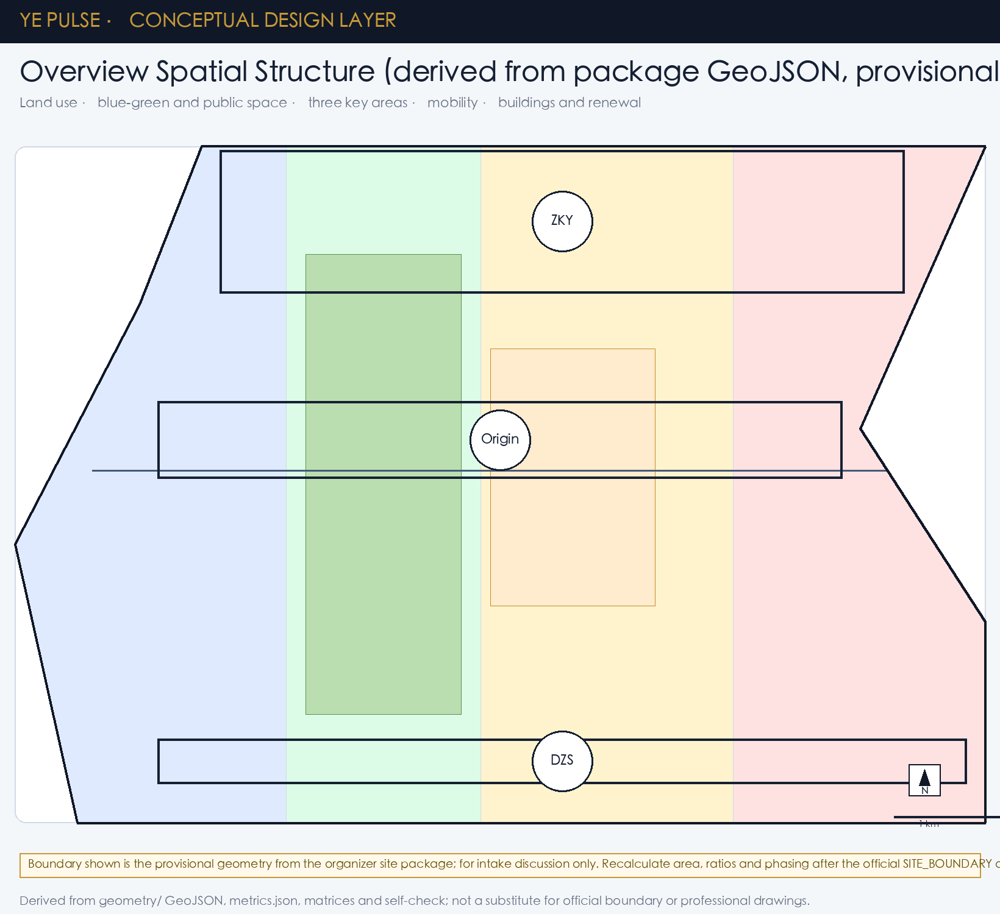

# Ye Pulse: Human-Centered AI Belt

## Identity concept: Ye Pulse

“Ye” is translated here into visible light and a continuous pulse. **Ye Pulse** is a conceptual identity that connects the Jing-Zhang railway memory, AI innovation nodes and everyday public services with warm amber signals over a blue-green walking network. A forked light mark, abstracted from the Chinese character “烨”, is proposed as a map legend and wayfinding accent. It is not an approved government brand, statutory planning name or implementation commitment; the organizers and rights holders must review it before use [source:OFFICIAL-ANNOUNCEMENT] [assumption:YE-PULSE-CONCEPT-ONLY].

The concept has three auditable actions: Ye Light Nodes for reservable public demonstrations and enterprise services; a Ye Walking Line for continuous wayfinding, access and night safety; and a Ye Review Loop using public, aggregated and revocable service data. No personal trajectories are collected and an agent never replaces planning approval.

## Evidence, scope and assumptions

This proposal follows the official international design prequalification notice and the repository taskbook. The study area is approximately 43.6 km², the overall design area approximately 11.4 km², and the three key areas together approximately 368.4 ha. The checked GeoJSON layers and metrics are the machine-readable evidence; the current boundary and key-area polygons remain provisional until official geometry is published. Every area, ratio and capacity claim must be recomputed after that replacement [source:OFFICIAL-ANNOUNCEMENT] [source:AGENT-TASKBOOK].

## Three-level spatial framework

At the research scale, Ye Pulse builds a chain from universities and open-source communities to enterprise conversion, public experience and international communication. At the overall-design scale, it translates that chain into land use, renewal projects, mobility, municipal support and a coherent cityscape. At the key-area scale, it tests detailed programs, building interfaces, public-space continuity, transport and implementation dependencies.

The spatial concept is **one heritage-and-innovation belt, three anchors, distributed scenarios and a blue-green mobility loop**. The three anchors are Zhongzhi Park, Beijing AI Origin Community and Dazhongsi AI Cluster. They are design interpretations of the brief, not new red lines.

## Overall design and future-city strategy

The belt combines AI research, open collaboration, enterprise services, talent life and public-facing culture. Low-efficiency spaces are catalogued as renewal opportunities; the land-use, building, road, green-space, public-space and phasing layers express the proposal as a reviewable set of objects rather than a slogan. Height, intensity, setbacks and statutory road lines remain “to be confirmed by the formal plan” wherever authoritative controls are unavailable.

The urban AI layer is deliberately modest: it may help find walking gaps, summarize aggregated facility demand, support maintenance and review event-safety risks. It must be explainable, privacy-minimizing, human-reviewed and reversible.

## Three key areas

**Zhongzhi Park AI Autonomous Innovation Accelerator**: a garden-like full-stack innovation district with low-carbon testing, standards workshops, safety-governance displays and a stronger Qinghe interface.

**Beijing AI Origin Community**: a near-campus conversion and talent neighborhood linking campus, park and street through walking and cycling; it provides open-source release, results publishing, legal/IP and daily-life services.

**Dazhongsi AI Industry Cluster**: an urban intelligent-economy and international-contact district around the station, with four-quadrant pedestrian continuity, intelligent-agent and terminal demonstrations, data-element services and public-facing enterprise frontage.

## AI ecosystem, users and scenario cards

The user set includes open-source developers, start-ups, enterprise visitors, residents and university communities. Their needs—release, co-working, compute access, talent housing, daily services, learning and international contact—are mapped to public rooms, service nodes and the mobility loop. Ten scenario cards are included: open-source release hall; safety-governance sandbox; edge-compute station; explainable AI walking guide; Dazhongsi international roadshow room; Qinghe low-carbon innovation corridor; near-campus conversion street; data-element salon; AI daily-service street; and a global AI activity route.

Each card must state its user, spatial carrier, data boundary, human-review rule and operating responsibility. Public-space, green-space and road layers provide the spatial evidence; no scenario is a claim that a government program already exists.

## Land use, buildings and renewal

The proposal keeps a legible mixed-use structure: innovation and enterprise services near the anchors, civic and cultural interfaces along the heritage belt, residential and daily-life support near transit, and a connected green-public-space system. Buildings are represented as design footprints and renewal categories, not as approved development rights. Retain, adapt and replace decisions are reversible until surveys, ownership and statutory conditions are confirmed.

## Mobility, municipal systems and blue-green public space

The mobility framework prioritizes transit-to-walk connections, a fine-grained street loop, accessible crossings, bicycle parking and low-speed public-space edges. The blue-green system links the Jing-Zhang heritage park, Qinghe-facing open space and neighborhood courtyards. Ye Light Nodes use low-glare, energy-aware lighting and clear multilingual wayfinding. Stormwater, distributed energy and edge-compute prototypes are presented as testable options with maintenance owners, not as installed assets.

## Phasing and implementation

Phase 0 (0–12 months) confirms official boundaries, audits ownership and accessibility, and pilots one Ye Light Node and one open-source release room. Phase 1 (1–3 years) connects the three anchors, delivers walking gaps and public-service prototypes, and publishes aggregated evaluation data. Phase 2 (3–8 years) scales enterprise services and the international route only after independent review. Each phase has a responsible actor, dependency, reversible trial and stop condition.

## Metrics and validation

The package records site and key-area geometry, land-use coverage, building footprints, road and green/public-space layers, scenario counts and phasing objects. Metrics distinguish official facts, design recommendations and provisional values. Core checks include geometry coverage/no overlap, key-area count, public-space and green ratios, building footprint area, scenario completeness and evidence links. Replace the provisional polygons and rerun all checks before any statutory or investment decision.

## JZ-01..JZ-06 implementation matrix (actor, phasing, KPI, exit)

The table below advances the proposed projects from a "list" to the level of detail that a professional team can refine. The "Lead actor" and "Co-actor" columns are **suggestions**, not commitments; real implementation must follow official control planning, municipal, ownership and approval outcomes.

| ID | Project | Type | Lead / co-actor | Start condition | Phase milestones (T+M) | Resource scale | Main risk | Acceptance KPI (suggested) | Pause / exit condition |
|---|---|---|---|---|---|---|---|---|---|
| JZ-01 | Jing-Zhang Heritage Park slow-traffic gap stitching | Public space / mobility | Haidian Urban Management + sub-district + university volunteers + design team | Road red-line + under-bridge ownership confirmed | M+3 pilot node / M+9 corridor open / M+24 full nodes accepted | Medium (CNY 100M scale, requires control plan) | Under-bridge ownership unclear; low pedestrian volume | Walking-gap closure ≥ 80%; night-lighting coverage ≥ 90%; crossing volume +30% | Red-line conflict or volume too low → pause peripheral nodes |
| JZ-02 | Zhongzhiyuan Qinghe innovation frontage | Blue-green / industry showcase | Haidian Water Authority + sub-district + lead enterprises + design team | River blue-line + flood-control + ecological assessment | M+6 pilot / M+18 main frontage open / M+36 full acceptance | High (hydraulic works) | Flood safety; ecological sensitivity | Public open frontage ≥ 70%; ≥ 6 open public events / year | Flood or ecological assessment fails → pause hard works |
| JZ-03 | Origin Community near-campus commercialization street | Renewal / industry | Zhongguancun Science City + universities + start-ups + property owners | Campus boundary + ownership + ground-floor viability | M+6 pilot tenancy / M+24 main street open / M+36 stable platform | Medium (depends on ownership coordination) | Fragmented ownership; rent affordability | Conversion occupancy ≥ 60%; ≥ 12 campus-enterprise events / year | Ownership deadlock or rent overshoot → shrink |
| JZ-04 | Dazhongsi station four-quadrant pedestrian connectivity | Rail integration / slow traffic | Beijing MTR + Haidian Transport + utility owners + design team | Rail red-line + utility survey + approval interface | M+6 pilot quadrant / M+24 two open / M+36 all quadrants | High (utility relocation) | Utility relocation; night-work constraints | 500m pedestrian connectivity ≥ 95%; barrier-free path 100% | Utility cost over budget 30% → phase the works |
| JZ-05 | AI public service and edge-compute nodes | New infrastructure / public service | Haidian S&T + compute operator + sub-district + design team | Energy access + compute safety review + operating entity | M+6 single pilot / M+18 three-node network / M+36 area-wide | High (compute + energy) | Energy footprint; data security | Compute utilization ≥ 40%; ≥ 5 public service interfaces | Sustained vacancy ≥ 50% → freeze new nodes |
| JZ-06 | Global AI Week public route | Operation / brand | Haidian Culture & Tourism + sub-district + associations + international partners | Public space permits + safety assessment + rights clearance | M+3 route trial / M+12 full open / M+24 inaugural global week | Medium (event-led) | Event safety; cultural-symbol rights | Daily visitors ≥ 5,000; ≥ 10% international participants | Any safety incident → immediate pause and review |

> Note: Phasing uses T = project kick-off month. M+N means N months after kick-off. All KPIs and exit conditions are **suggestions**; a professional team must reconfirm them once formal control conditions are known.

## Inclusion supplement: vulnerable and access-limited groups

Beyond the developer / start-up / enterprise visitor / resident / student personas covered in the main narrative, this section lists six vulnerable or access-limited groups with concrete needs and spatial responses, as a refinement-stage checklist:

| Group | Core need | Spatial and service response | Verification indicator |
|---|---|---|---|
| Older adults (60+) | Slow walking, legible signage, shelter, rest seats | Rest nodes every 200m along blue-green public space; sun shelters; night high-contrast signage; slow-traffic slope ≤ 2% | ≥ 4 rest nodes per 1km; barrier-free slope compliance 100% |
| Children (3–12) | Safe school commute, parental waiting, toilets, baby rooms | Dedicated school commute routes in key areas + parent waiting zones; public toilets every 500m; baby rooms per national standard | Public toilet coverage ≥ 95%; ≥ 1 children's activity space per key area |
| People with disabilities (visual / wheelchair / hearing) | Barrier-free access, tactile guidance, audio/visual aids | Continuous tactile paving; tactile guidance bricks at key nodes; elevator audio cues; hearing-loop in theatres/exhibits | Barrier-free path continuity ≥ 95%; barrier-free toilet coverage 100% |
| Low digital-literacy / elderly | Non-App service access, in-person service, phone hotlines | Every AI scenario keeps an offline counter or phone entry; no mandatory QR codes | ≥ 1 offline interface per key area; in-person service ≥ 30% of opening hours |
| Night / shift workers | 24h safe passage, night food, safety lighting | Slow-traffic corridors ≥ 50 lux at night; ≥ 1 24h convenience store / light-meal spot per key area; emergency call points ≤ 300m | Night luminance compliance ≥ 90%; emergency response ≤ 5 minutes |
| Low-income / temporary visitors | Affordable housing, food, public services | ≥ 15% affordable rental housing in key areas; tiered public canteens; free Wi-Fi and rest space coverage | Affordable rental completion 100%; ≥ 30 free rest seats per key area |

> No AI scenario, mechanism or data-governance proposal may replace the offline alternatives or in-person override for these groups with an online-only entry. `assumptions.json` and `compliance_matrix.json` should record the sources and verification responsibility for these personas in parallel.

## Risk, rights and review statement

The package is released under `COMMUNITY-DISPLAY-ONLY`. It does not grant planning, procurement or construction rights. Personal data, campus data, enterprise marks, imagery and third-party content require permission. The GitHub contributor is responsible for this package; the repository maintainers and public authorities retain review and acceptance decisions. “Ye Pulse” is a personal design signature made public as a conceptual layer, not a claim of endorsement.
